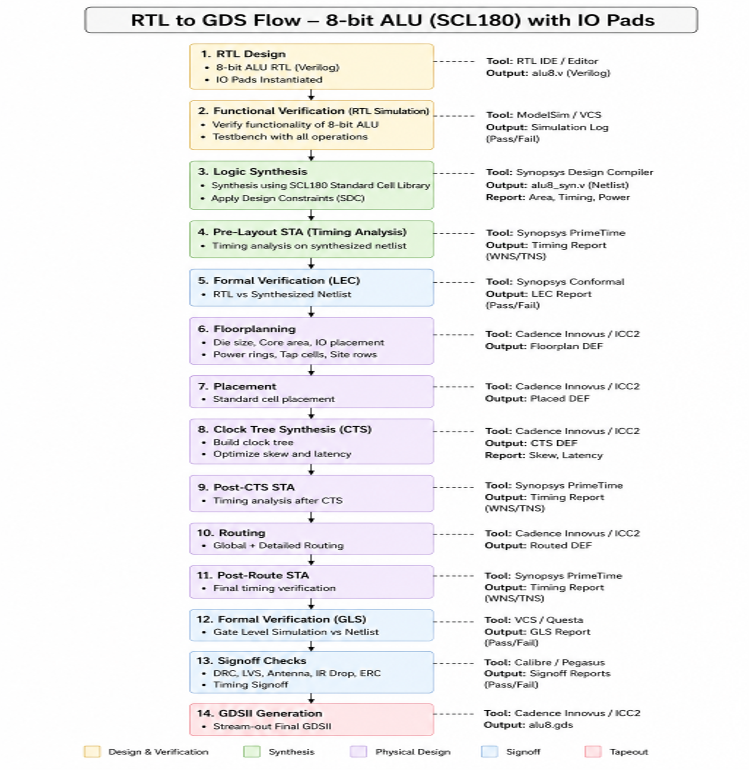

# RTL-to-GDSII Implementation of an 8-bit Synchronous ALU

> Complete ASIC Design Flow using **Verilog HDL**, **Cadence Genus**,
> **Cadence Innovus**, **Cadence Tempus**, and **Cadence Virtuoso** with
> the **SCL180 Standard Cell Library**.

------------------------------------------------------------------------

# Overview

This project demonstrates the complete **Register Transfer Level (RTL)
to GDSII** implementation flow of a synchronous **8-bit Arithmetic Logic
Unit (ALU)** using commercial Cadence Electronic Design Automation (EDA)
tools.

The objective of this project was to gain hands-on experience with the
complete ASIC physical design flow followed in semiconductor industries.
Beginning with RTL design in Verilog HDL, the implementation progresses
through synthesis, timing verification, logical equivalence checking,
floorplanning, placement, clock tree synthesis, routing, physical
verification, and finally generates a fabrication-ready GDSII layout.

Unlike FPGA-only implementations, this project focuses on understanding
the complete backend ASIC design methodology required to manufacture an
integrated circuit.

------------------------------------------------------------------------

# Features

-   8-bit synchronous ALU designed in Verilog HDL
-   Arithmetic, logical, and shift operations
-   Complete RTL-to-GDSII ASIC flow
-   SCL180 Standard Cell Library
-   Static Timing Analysis (STA)
-   Logical Equivalence Checking (LEC)
-   Clock Tree Synthesis (CTS)
-   Physical Design using Cadence Innovus
-   Final GDSII generation in Cadence Virtuoso

------------------------------------------------------------------------

# RTL-to-GDSII Design Flow

``` markdown

```

The implementation follows the standard industrial ASIC design flow:

## 1. RTL Design

The ALU was designed using Verilog HDL as a synchronous digital circuit.
It accepts two 8-bit operands, a 4-bit select signal, clock, and reset
inputs to perform arithmetic and logical operations.

## 2. RTL Simulation

A Verilog testbench verified the functionality of all supported ALU
operations before synthesis.

## 3. Logic Synthesis

Cadence Genus synthesized the RTL into a technology-mapped gate-level
netlist using the SCL180 standard cell library while optimizing area,
timing, and power.

## 4. Static Timing Analysis (STA)

Timing analysis verified setup and hold requirements, ensuring positive
slack and reliable operation at the target clock frequency.

## 5. Logical Equivalence Checking (LEC)

Cadence Conformal verified that the synthesized gate-level netlist was
functionally equivalent to the original RTL.

## 6. Floorplanning

The chip core area, IO pads, power rings, and placement rows were
defined to prepare the design for physical implementation.

## 7. Placement

Standard cells were optimally positioned to minimize routing congestion
and improve timing performance.

## 8. Clock Tree Synthesis (CTS)

A balanced clock distribution network was generated to minimize clock
skew and insertion delay.

## 9. Routing

Global and detailed routing connected all cells using multiple metal
layers while satisfying design rules.

## 10. Post-Route STA

Timing analysis was repeated after routing using extracted interconnect
delays to verify timing closure.

## 11. Signoff Checks

Physical verification included: - Design Rule Check (DRC) - Layout
Versus Schematic (LVS) - Electrical Rule Check (ERC) - Antenna Check -
IR Drop Analysis

## 12. GDSII Generation

The final physical layout was streamed into Cadence Virtuoso as a GDSII
file suitable for fabrication.

------------------------------------------------------------------------

# Supported ALU Operations

  Select       ->      Operation

  0000         ->      Addition
  
  0001         ->      Subtraction
  
  0010         ->      AND
  
  0011         ->      OR
  
  0100         ->      XOR
  
  0101         ->      NOT
  
  0110         ->      NAND
  
  0111         ->      NOR
  
  1000         ->      Shift Left
  
  1001         ->      Shift Right

------------------------------------------------------------------------

# Design Flow Summary

  Stage                                ->      Tool
  
  RTL Design                           ->      Verilog HDL
  
  RTL Simulation                       ->      ModelSim / Simulator
  
  Logic Synthesis                      ->      Cadence Genus
  
  Static Timing Analysis               ->      Cadence Tempus
  
  Logical Equivalence Check            ->      Cadence Conformal
  
  Floorplanning                        ->      Cadence Innovus
  
  Placement                            ->      Cadence Innovus
  
  Clock Tree Synthesis                 ->      Cadence Innovus
  
  Routing                              ->      Cadence Innovus
  
  GDSII Generation                     ->      Cadence Virtuoso

------------------------------------------------------------------------

# Results

## RTL Simulation

``` markdown

```

## Synthesized Gate-Level Netlist

``` markdown

```

## Timing Analysis

``` markdown

```

## Floorplanning

``` markdown

```

## Pad Placement

``` markdown

```

## Power Planning

``` markdown

```

## Placement

``` markdown

```

## Clock Tree Synthesis

``` markdown

```

## Routing

``` markdown

```

## Final GDSII Layout

``` markdown

```

------------------------------------------------------------------------

# Cadence Tools Used

-   Cadence Genus
-   Cadence Tempus
-   Cadence Innovus
-   Cadence Virtuoso

------------------------------------------------------------------------

# Technologies

-   Verilog HDL
-   ASIC Design
-   RTL Design
-   Physical Design
-   Static Timing Analysis
-   Clock Tree Synthesis
-   SCL180 Standard Cell Library
-   VLSI Design

------------------------------------------------------------------------

# Future Improvements

-   Scan chain insertion (DFT)
-   Low-power optimization
-   Multi-clock support
-   Complete RISC-V SoC implementation
-   Tape-out ready verification

------------------------------------------------------------------------

# Author

**Sharthak Raj**

Electronics and Communication Engineering\
KLE Technological University

GitHub: https://github.com/sharthakraj2004-hub
